<p align="center">
  
</p>

<p align="center">
  <a href="https://github.com/adonay1991/herald/actions/workflows/ci.yml"></a>
</p>

<p align="center">
  <a href="docs/CONTRACT.md">agent contract</a> ·
  <a href="docs/SINKS.md">terminal contract</a> ·
  <a href="CHANGELOG.md">changelog</a> ·
  <a href="LICENSE">MIT</a>
</p>

**Agent- and terminal-agnostic notification dispatcher for AI coding agents.**

You run coding agents — Claude Code, Codex, Gemini CLI, nightly automation —
across terminals, multiplexers and headless jobs. Each one notifies
differently, or not at all: one agent shows banners, another is silent, your
crons only notify inside one specific multiplexer, and on macOS 26 half the
classic notification tooling exits 0 while showing *nothing*. You either get
notification spam while you're already looking at the terminal, or silence
when an agent has been waiting 20 minutes for a permission you never saw.

herald fixes this with one small funnel:

```
 agent payload ──▶ adapter ──▶ canonical Event ──▶ routing ──▶ sink
 (any format)                  {source, kind,      (pure       (muxer UI,
                                urgency, body…}     policy)     native banner,
                                                                your command)
```

Any agent can plug in. Any terminal can plug in. The routing in the middle is
a single, boring, fully-tested policy that answers one question: *does the
human actually need to see this, and where?*

---

## Why it behaves the way it does

Three rules, in priority order:

1. **Urgency decides delivery.** `critical` (agent blocked on you, errors)
   always notifies. `normal` (turn complete) notifies **only when you're not
   looking** — focus-aware on macOS and X11, always in headless jobs. `low`
   (FYI, lifecycle) is logged, never shown.
2. **The terminal harness owns the pane.** Inside a multiplexer that has its
   own notification UI (herdr, cmux, or your own via an `exec` sink), herald
   hands the event to the muxer and suppresses the system banner — no double
   notifications.
3. **A notification dispatcher must never break an agent's turn.** Hook entry
   points always exit 0, every spawned process has a 2-second budget, and a
   broken config falls back to sane defaults with a warning. Fail-open,
   always.

Plus three quality-of-life guards: **burst coalescing** (an identical event
delivered moments ago is not repeated — subagent fan-outs produce one banner,
not N), **quiet hours** (everything below critical is log-only inside the
window), and **tmux awareness** (the terminal-app focus answer lies inside
tmux, so herald treats focus as unknown and notifies).

Everything herald does or decides not to do is appended to
`~/.local/state/herald/events.jsonl`, so "why didn't I get notified?" is a
`herald log` away, and "why is my pipeline broken?" is `herald doctor`.

## The macOS 26 problem (read this if banners silently vanish)

On macOS 26 (Tahoe) the legacy notification API — the one `osascript` and
`terminal-notifier` use — is dead: calls **succeed silently**. No banner, no
permission prompt, no error. The only path macOS still honors is
`UNUserNotificationCenter`, which requires a real `.app` bundle identity.

herald ships a ~90-line Swift presenter (`app/`) that does exactly this and
nothing else. Build and install it with:

```sh
herald doctor --install-app
```

The system sink then cascades: **presenter app → terminal-notifier →
osascript**, so older Macs keep working with whatever they have. If you
already have a working, *authorized* presenter bundle, point herald at it
instead — Notification Center registration of new bundles has been flaky on
Tahoe, so herald never replaces a working presenter, it installs alongside
and lets you switch after verifying authorization (`herald doctor` shows the
`authorizationStatus`).

```toml
[sinks.macos_native]
app_path = "/Users/me/Applications/MyWorkingPresenter.app"
```

The presenter contract is deliberately CLI-trivial — `<binary> <title>
<message> [sound]` plus `<binary> status` — and herald resolves the binary as
the first file in `Contents/MacOS`, so any conforming bundle works.

## Install

```sh
# Homebrew (macOS)
brew tap adonay1991/tap && brew install herald

# or with cargo
cargo install --git https://github.com/adonay1991/herald

# then
herald doctor                 # is the pipeline healthy? what context am I in?
herald doctor --install-app   # macOS: build the native presenter (see caveat above)
herald test                   # synthetic event through the real pipeline
herald test --dry-run         # ...or just print what WOULD happen
```

Prebuilt macOS arm64 binaries are attached to
[releases](https://github.com/adonay1991/herald/releases).

Requirements: Rust 1.94+. macOS fully supported; Linux compiles and routes
(focus detection and a notify-send backend are stubs for now — see Status).

## Plug in your agents

### Claude Code

`~/.claude/settings.json` — herald reads the hook JSON from stdin and maps
`Notification` → attention (critical), `Stop` → turn-complete (normal),
`SubagentStop`/lifecycle → log-only:

```jsonc
"hooks": {
  "Notification": [{ "hooks": [{ "type": "command", "command": "herald hook claude" }] }],
  "Stop":         [{ "hooks": [{ "type": "command", "command": "herald hook claude" }] }]
}
```

### Codex CLI

`~/.codex/config.toml` — Codex passes the payload as the final argv element.
Root key, machine-local config, absolute path (Codex does not expand `~`):

```toml
notify = ["/abs/path/to/herald", "hook", "codex"]
```

### Gemini CLI (experimental)

Gemini hooks use a Claude-compatible stdin envelope; wire `herald hook gemini`
the same way you'd wire Claude. Marked experimental until the schema is
pinned with real fixtures.

### Anything else — crons, scripts, your own agent

This is the actual integration contract; the built-in adapters above are just
conveniences for protocols herald pins with fixtures. One JSON on stdin, or
plain flags:

```sh
herald emit --source cron:backup --kind error --body "backup failed"

echo '{"source":"my-agent","kind":"attention","body":"waiting for approval"}' \
  | herald emit --json
```

Full Event schema, kind semantics and the stability guarantee:
[docs/CONTRACT.md](docs/CONTRACT.md).

## Plug in your terminal

If your terminal/multiplexer has its own notification UI, declare it — one
env var to detect it, one command to deliver:

```toml
[[sinks.exec]]
name = "myterm"
when_env = "MYTERM_SOCKET"          # active when this env var is set
command = ["myterm-notify", "--stdin"]
exclusive = true                     # owns the pane: suppress the system banner
```

Your command receives the canonical Event JSON on stdin. Built-in sinks for
**herdr** (`herdr notification show`) and **cmux** (`cmux notify`) implement
this same contract with pinned transports. Details:
[docs/SINKS.md](docs/SINKS.md).

## Routing at a glance

| Context (auto-detected) | attention / error | turn-complete | info / lifecycle |
|---|---|---|---|
| herdr (`HERDR_ENV`) | muxer notification | muxer notification | log only |
| cmux (`CMUX_SURFACE_ID`) | muxer notification | muxer notification | log only |
| plain terminal | banner, always | banner **only if unfocused** | log only |
| headless (cron, launchd, CI) | banner (persists in Notification Center) | banner | log only |

Overrides are deliberately flat — no rule engine:

```toml
[routing]
turn-complete = "never"       # always | unfocused | never, per kind
burst-window-ms = 2000        # coalesce identical events (0 disables)
quiet-hours = "23:00-08:00"   # below-critical → log only (wraps midnight)

[sinks.macos_native]
sounds = { critical = "Sosumi", normal = "" }   # "" = silence

[sinks.osc]                   # opt-in: in-terminal OSC notifications
enabled = true                # kitty, Ghostty, iTerm2, WezTerm, ...
protocol = "osc9"             # osc9 | osc777
exclusive = false             # true = replace the system banner
```

## Commands

| Command | Purpose |
|---|---|
| `herald hook claude\|codex\|gemini` | Agent hook entry points (always exit 0) |
| `herald emit --source S --kind K --body B` / `--json` | Universal integration contract |
| `herald doctor [--install-app] [--json]` | Full pipeline diagnosis: config, context, presenter authorization, backends, log |
| `herald test [--kind K] [--sink S]` | Synthetic event through the real pipeline |
| `herald log [-n N] [-f] [--raw] [--stats]` | Inspect, tail or aggregate the events log |

Global flags: `--dry-run` (print the exact delivery plan as JSON, execute
nothing), `--config PATH`.

## Design notes, for the curious

- **Effects are data.** Sinks don't execute anything; they return `Action`
  values (spawn this argv, feed this stdin, cascade these until one
  succeeds). A single executor runs them. That's why `--dry-run`, the test
  suite and `doctor` are the same code path and why sink behavior is
  unit-testable without a GUI.
- **Routing is a pure function** of (event, detected context, config, focus).
  The entire default policy is three rows; the test suite covers it
  table-driven.
- **Adapters are functions, not plugins.** The set of built-in protocols is
  closed and pinned with real fixtures; everyone else uses `emit --json`. A
  five-line wrapper beats a mapping DSL that grows into a Turing tarpit.
- **No async runtime, no daemon.** One event = one short-lived process, a few
  milliseconds of work, hard 2 s ceilings. Nothing to keep alive, nothing to
  leak.

## Status

- macOS: complete — focus detection, native presenter with click-to-activate,
  cascade for pre-Tahoe Macs.
- Linux: `notify-send` backend with 1:1 urgency mapping; focus detection on
  X11 (`WINDOWID` + `xdotool`); Wayland reports unknown (herald notifies
  rather than risk silence). CI runs the full suite on Linux.
- Windows: not planned.

## License

MIT
